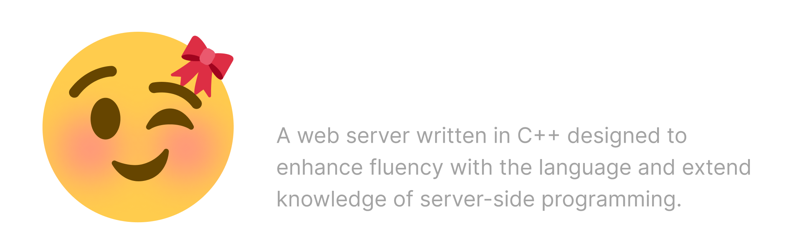

## Accomplishments (WIP)
- Implemented file-based routing similar to Next.js
- Developed a basic sequential/persistent server model
- Added support for processing various assets based on requests
- Automatically resolves media/source files

<details><summary>Todo</summary>

- Add Lunix 🐧 support
- Make work with [Next.js](https://nextjs.org/) and [Vite](https://vite.dev/)
  
</details>

## Build/Use the Project
Requires Visual Studio, and Ninja build environment: https://ninja-build.org/

```bash
# Clone the Repository
> git clone https://github.com/swoorpious/web_server_cpp.git web_server_cpp
> cd web_server_cpp

# Generate Ninja Build Files
> mkdir build
> cd build
> cmake -G Ninja -DCMAKE_BUILD_TYPE=Debug ..
> ninja # ninya

# Run the Server
> cd build
> web_server_cpp
```


## Sources/Credits
- _Web Server from Scratch_ series on YouTube by Eric O Meehan: [https://youtube.com/@eom-dev](https://www.youtube.com/@eom-dev/videos)
- Microsoft Winsock2 Reference: [https://learn.microsoft.com/windows/win32/winsock](https://learn.microsoft.com/en-us/windows/win32/winsock/winsock-reference) 
- Medium Article by @skreweverything: [https://medium.com/from-the-scratch/http-server...](https://medium.com/from-the-scratch/http-server-what-do-you-need-to-know-to-build-a-simple-http-server-from-scratch-d1ef8945e4fa)
- Web server written in Rust by @is-it-ayush: [https://github.com/is-it-ayush/hotpocket](https://github.com/is-it-ayush/hotpocket)
- Emoji logo edited/borrowed from: [https://github.com/twitter/twemoji](https://github.com/twitter/twemoji)
